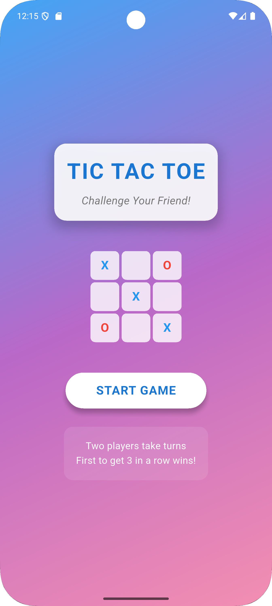
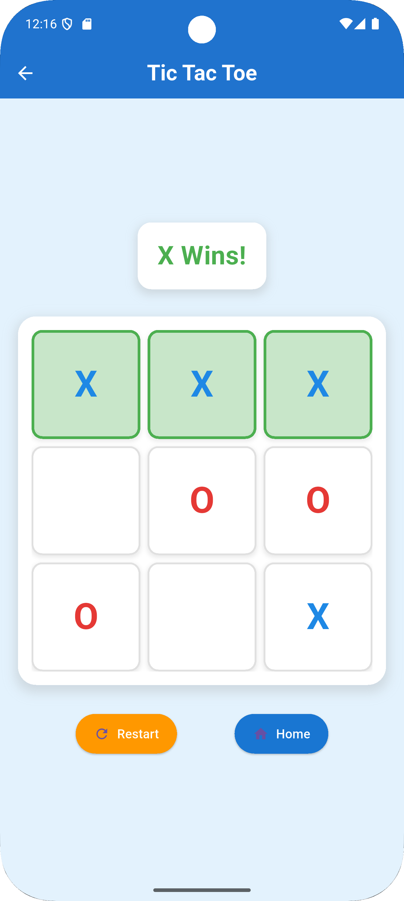
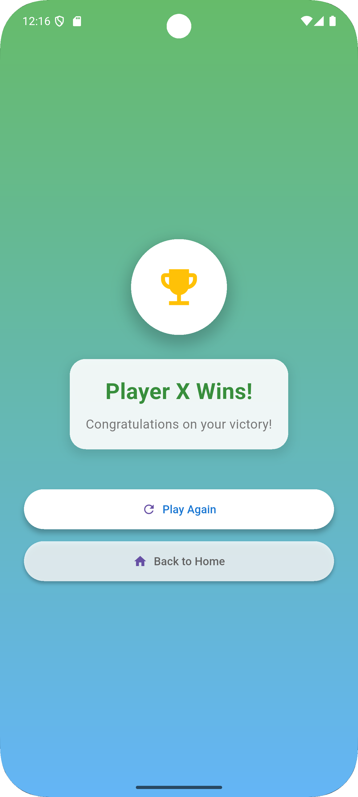

# 🎮 Tic-Tac-Toe Flutter App

A simple yet elegant implementation of the classic **Tic-Tac-Toe (X-O)** game built using **Flutter**. This app allows two players to play turn-by-turn, shows the winner/draw message, and resets the board for a new game. It's responsive and works well on both Android and iOS devices.

## 🎥 Demo Video

▶️ [Watch the demo video](https://drive.google.com/file/d/1qrSbnDnysYRk6qNl1gi1sKAjC99Er_eD/view?usp=sharing)

## 🖼️ Screenshots
### 🔹 Home Screen

### 🔹 Game Board

### 🔹 Winner Dialog
|

## 🚀 Features

- 🎯 Two-player turn-based game
- 🧠 Intelligent logic to check for winners or a draw
- ♻️ Board resets automatically for new games
- 🎨 Clean and responsive UI
- 📱 Runs on Android and iOS
